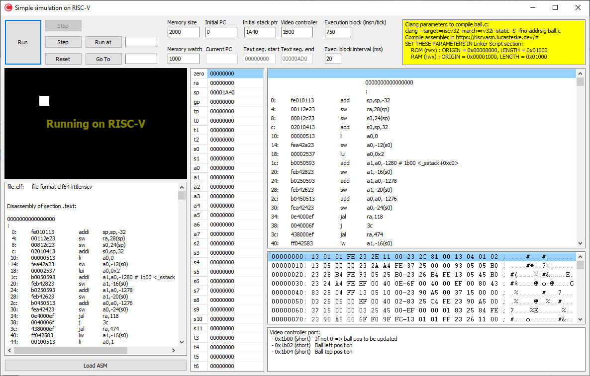

# Simulation on RISC-V



This repository houses (another) RV32I emulator developed in C++ Builder and a simple visualizer to inspect RISC-V registers and memory updates.

ball.c is the source code of program used in visualizer.

Compile ball.c in a Debian-based Linux distribution with Clang compiler and generate the assembler (.s) file. Than navigate to [Lucas Teske's RISC-V Online Assembler](https://riscvasm.lucasteske.dev/#) and compile the .s file. Finally put the "Objdump Code Disassembly" content in visualizer executable and run the simulation.

Binary can be downloaded from [Made Network website](https://www.madenetwork.net/riscv).

## Table of Contents
- [Building ball.c and run the simulation](#building-ball-c-and-run-the-simulation)
- [Building the visualizer](#building-the-visualizer)
- [Binary download](#binary-download)
- [Dependencies and Credits](#dependencies-and-credits)
- [License](#license)

## Building ball.c and run the simulation

1. On a Debian-based Linux distribution install Clang:
```bash
sudo apt install -y clang
```

2. Then compile ball.c with Clang:
```bash
clang --target=riscv32 -march=rv32i -static -S -fno-addrsig ball.c
```

3. Open ball.s file and cut the 2nd and 3rd lines in .text section:
```bash
    .attribute 4, 16
    .attribute 5, "rv32i2p0"
```

4. Then navigate to Lucas Teske's RISC-V Online Assembler [https://riscvasm.lucasteske.dev/#](https://riscvasm.lucasteske.dev/#) and put ball.s file in the assembly code text area (on the top-left).

5. Instead, in the Linker Script parameters (on the right) change these parameters:
```bash
__heap_size   = 0x200;
__stack_size  = 0x800;

MEMORY
{
  ROM (rwx) : ORIGIN = 0x00000000, LENGTH = 0x01000
  RAM (rwx) : ORIGIN = 0x00001000, LENGTH = 0x01000
}
```

6. Click the **Build** button and copy the *Objdump Code Disassembly*.

7. Open **SimulationOnRiscV.exe** visualizer and paste the binary + assembly code in the input area on left bottom.

8. Click the **Load ASM** button.

9. Click the **Run** button.

## Building the visualizer

From the *src* directory open and compile the *SimulationOnRiscV.cbproj* project with C++ Builder.

## Binary download

(Not signed) binary is available at:
[www.madenetwork.net/riscv](https://www.madenetwork.net/riscv)

- **Exe name:** SimulationOnRiscV.exe
- **Size:** 9,357,379 bytes
- **MD5:** 3717cd415754a9b9e1f29ae2c8471d48
- **SHA1:** 9ef9b71d244460328c4f842ab8dc6035845d55af
- **SHA256:** 6725c30137e3c72826bc3ff070b5fd3cb60cccb0387faa8b90a67ed0333c156e
- **SHA512:** 7d4ff07e1e998d65a72164f1958142cec415df7e176488b4531c76bdccc2b44e6dd62bd441279ae5ddceeb607e1bd1eac56d1e8d0d50685001cde35b7b9d8f57

## Dependencies and Credits

- [Lucas Teske's RISC-V Online Assembler](https://riscvasm.lucasteske.dev/#)
- [GNU Compiler Collection](https://github.com/gcc-mirror/gcc/) for ball.c sample file

## License

This repository is licensed under the GNU GPLv3.

The RISC-V trade name is a registered trademark of RISC-V International.